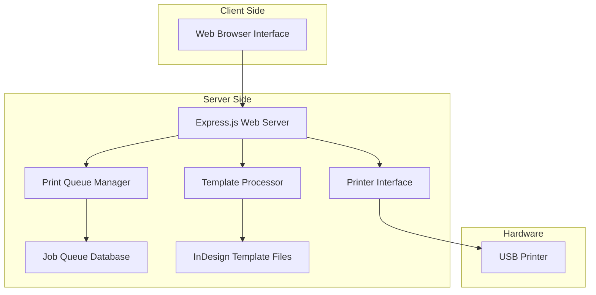

# Design Document

## Overview

The Festival Badge Printer is a web-based application that enables registration teams to efficiently create and print personalized badges using predefined templates. The system consists of a local web server that interfaces with USB printers and processes Adobe InDesign templates to generate print-ready badges.

The architecture follows a client-server model where the web interface runs in browsers while a Node.js backend handles printer communication, template processing, and job queue management. This design ensures the system works reliably in the local network environment typical of festival registration setups.

## Architecture



### Technology Stack

**Frontend:**
- HTML5/CSS3/JavaScript (vanilla or lightweight framework)
- WebSocket connection for real-time updates
- Responsive design for various screen sizes

**Backend:**
- Node.js with Express.js framework
- Socket.io for real-time communication
- Sharp or similar library for image processing
- node-printer or cups integration for printer communication

**Template Processing:**
- Adobe InDesign Server (if available) or
- Alternative: Convert InDesign templates to programmatic layouts using Canvas API or PDF generation

**Data Storage:**
- SQLite for job queue and session management (lightweight, file-based)
- File system for template storage

## Components and Interfaces

### 1. Web Interface Component

**Purpose:** Provides the user interface for badge creation and queue management

**Key Features:**
- Badge type selection with visual previews
- Form inputs for UID and Badge Name with validation
- Real-time queue status display
- Print job management controls

**Interface Methods:**
```javascript
// Client-side API calls
POST /api/badges - Submit new badge job
GET /api/queue - Retrieve current queue status
DELETE /api/jobs/:id - Cancel specific job
GET /api/templates - Get available badge templates
```

### 2. Print Queue Manager

**Purpose:** Manages the job queue and coordinates printing workflow

**Key Features:**
- FIFO job processing
- Job status tracking (queued, processing, completed, failed)
- Retry logic for failed jobs
- Queue size management

**Interface Methods:**
```javascript
class PrintQueueManager {
  addJob(badgeData)
  processNextJob()
  getQueueStatus()
  cancelJob(jobId)
  retryJob(jobId)
}
```

### 3. Template Processor

**Purpose:** Handles Adobe InDesign template integration and badge generation

**Key Features:**
- Template loading and parsing
- Text positioning based on InDesign layouts
- Badge preview generation
- Output format conversion (PDF/PNG for printing)

**Interface Methods:**
```javascript
class TemplateProcessor {
  loadTemplate(templateId)
  generateBadge(templateId, uid, badgeName)
  getTemplatePreview(templateId)
  validateTemplate(templatePath)
}
```

### 4. Printer Interface

**Purpose:** Manages communication with USB-connected printers

**Key Features:**
- Printer discovery and connection
- Preset configuration management
- Print job execution
- Status monitoring

**Interface Methods:**
```javascript
class PrinterInterface {
  discoverPrinters()
  connectToPrinter(printerId)
  printDocument(documentPath, presets)
  getPrinterStatus()
  applyPresets(presetName)
}
```

## Data Models

### Badge Job Model
```javascript
{
  id: String,           // Unique job identifier
  templateId: String,   // Selected badge template
  uid: String,          // User-provided unique identifier
  badgeName: String,    // User-provided badge name
  status: String,       // queued|processing|completed|failed
  createdAt: Date,      // Job creation timestamp
  processedAt: Date,    // Job completion timestamp
  retryCount: Number,   // Number of retry attempts
  errorMessage: String  // Error details if failed
}
```

### Template Model
```javascript
{
  id: String,           // Template identifier
  name: String,         // Display name
  filePath: String,     // Path to InDesign template
  previewPath: String,  // Path to preview image
  textFields: {         // Text field positioning
    uid: {
      x: Number,
      y: Number,
      fontSize: Number,
      fontFamily: String
    },
    badgeName: {
      x: Number,
      y: Number,
      fontSize: Number,
      fontFamily: String
    }
  },
  printerPresets: String // Associated printer preset name
}
```

### Printer Configuration Model
```javascript
{
  id: String,           // Printer identifier
  name: String,         // Printer display name
  isConnected: Boolean, // Connection status
  presets: {            // Available presets
    [presetName]: {
      paperSize: String,
      quality: String,
      orientation: String,
      margins: Object
    }
  }
}
```

## Error Handling

### Client-Side Error Handling
- Form validation with immediate feedback
- Network error detection and retry prompts
- Graceful degradation when WebSocket connection fails
- User-friendly error messages for all failure scenarios

### Server-Side Error Handling
- Comprehensive logging for all operations
- Graceful printer disconnection handling
- Template loading error recovery
- Database connection error management
- Job retry logic with exponential backoff

### Error Categories
1. **Validation Errors:** Invalid input data, duplicate UIDs
2. **System Errors:** Printer offline, template missing, disk space
3. **Network Errors:** Connection timeouts, WebSocket failures
4. **Processing Errors:** Template rendering failures, print job errors

## Testing Strategy

### Unit Testing
- Template processor functionality
- Print queue management logic
- Input validation functions
- Printer interface methods

### Integration Testing
- End-to-end badge creation workflow
- Printer communication reliability
- Template loading and processing
- WebSocket real-time updates

### System Testing
- Multi-user concurrent access
- Large queue processing performance
- Printer failure recovery
- Template compatibility verification

### User Acceptance Testing
- Registration team workflow simulation
- Interface usability validation
- Error scenario handling
- Performance under typical load

### Testing Tools
- Jest for unit and integration testing
- Puppeteer for browser automation testing
- Artillery for load testing
- Manual testing protocols for hardware integration

## Security Considerations

- Local network deployment reduces external attack surface
- Input sanitization for all user-provided data
- File system access restrictions for template directories
- Session management for concurrent users
- Printer access control to prevent unauthorized jobs

## Performance Requirements

- Badge job submission: < 500ms response time
- Queue status updates: < 2 seconds real-time update
- Template loading: < 1 second for preview generation
- Print processing: < 30 seconds per badge (excluding printer speed)
- Concurrent users: Support up to 5 simultaneous registration stations