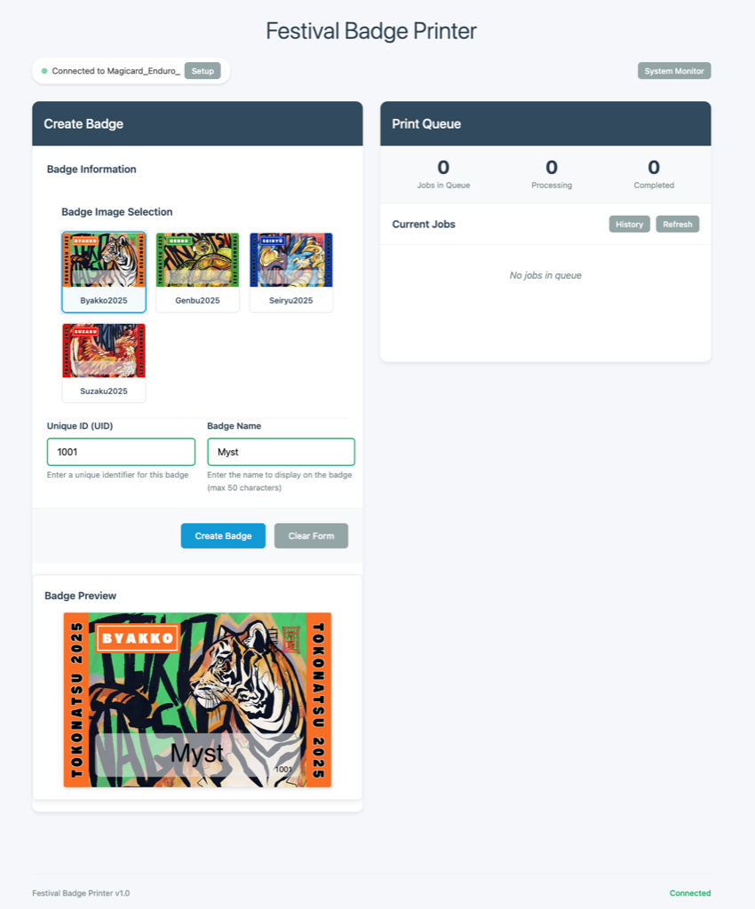
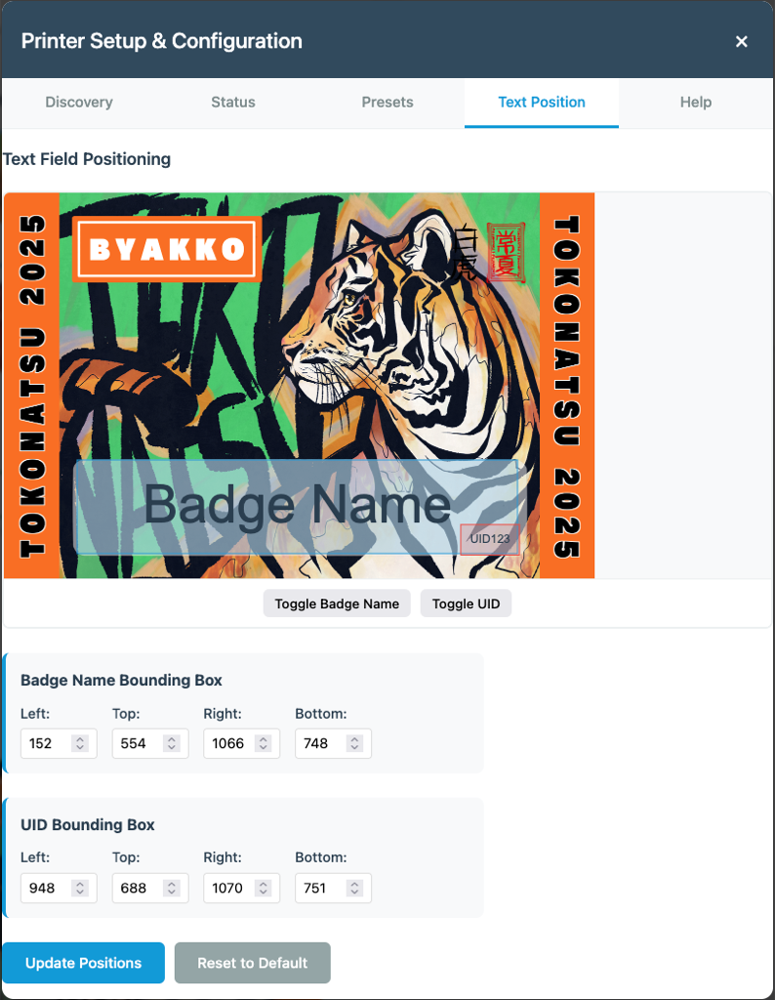

# Tokonatsu Festival Badge Printer

A web-based badge printing system for Tokonatsu's registration team.

This code was completely generated in [Kiro](https://kiro.dev/), a new AI IDE from Amazon that uses Spec Driven Development. This code was built overnight at the festival, to meet a specific problem that we had, I had to be at my computer to be able to print additional badges on the fly. Typically we would normally have people walk off with a hand written badge before they could come back for a pre-printed one, which would normally get queued and I would have to stay by the badge printer. I got fed up with this on the Wednesday night before the event, and thought, maybe Kiro could throw something together!

Our setup is a registrations desk outside in the field, connected through WiFi, using mobile devices and tablets with access to websites. I needed to be able to give them an interface that allows them to chose the "house" that the person was going into, and the badge name an UID for the person. This would then be sent to a USB MAGiCARD Enduro+ badge printer bought back in 2012 (very old!), and it needed to remove the specific HoloKote front that appears by default.

Within a few hours, Kiro was able to pull all this together, and I was able to host this from my Apple Mac Laptop! - While it was meant to be for all platforms, there was an issue with printing, so its using the `ld` command to send the final print, which makes this MacOS only at this time.

I do plan to integrate this into a new system, or rebuild, but I also wanted to show what Kiro could do in a pinch. With some minor tweaks, we went from a small prompt to full application that worked in a production level environment within a few hours.

For more information about our event, visit our [website](https://www.tokonatsu.org.uk) - Tokonatsu, a Japanese Culture Camping Festival in the UK.

# Features

- Web-based interface for badge creation
- Internal template system
- USB printer support with presets
- Real-time print queue management
- Multi-user support for registration teams

## Setup

### Prerequisites

- Node.js (v16 or higher)
- npm or yarn
- USB printer connected to the system

### Installation

1. Clone the repository
2. Install dependencies:

   ```bash
   npm install
   ```

3. Start the development server:

   ```bash
   npm run dev
   ```

4. Open your browser and navigate to `http://localhost:3000`

## Development

- `npm start` - Start the production server
- `npm run dev` - Start the development server with auto-reload
- `npm test` - Run tests
- `npm run test:watch` - Run tests in watch mode

## Project Structure

```
├── server/           # Backend server code
│   ├── index.js     # Main server entry point
│   ├── models/      # Database models
│   ├── routes/      # API routes
│   ├── services/    # Business logic
│   └── middleware/  # Express middleware
├── public/          # Frontend static files
│   ├── css/         # Stylesheets
│   ├── js/          # Client-side JavaScript
│   ├── images/      # Static images
│   └── index.html   # Main HTML file
└── templates/       # Badge template files
```

## Screen Shots

### Main Interface



### Text Position


